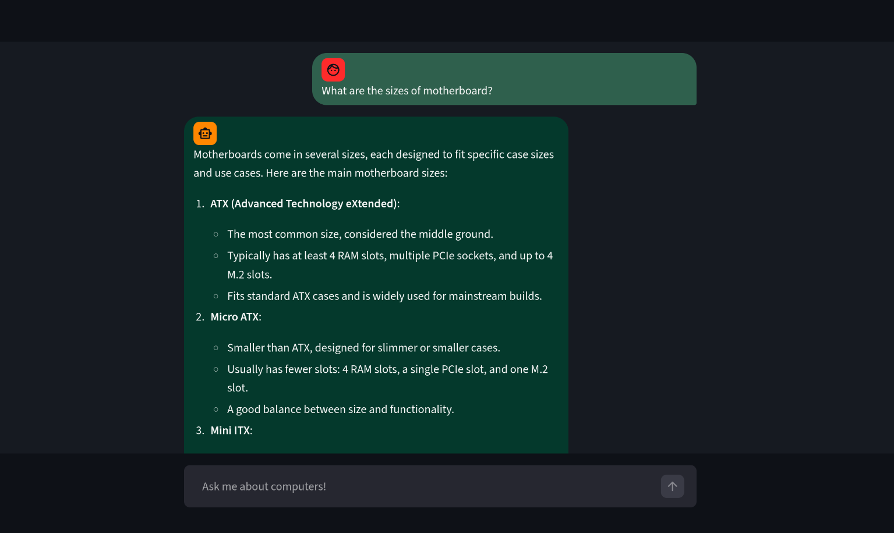

Simple RAG chatbot to answer questions about computer parts.  
Streamlit is used for the frontend, and calls are made to [Cohere's API](https://docs.cohere.com/) for the retrieval and response generation.  



## Setup

1. Clone repository:

```bash
git clone https://github.com/aplusjb/cs335sp26_group4_chatbot.git
cd cs335sp26_group4_chatbot
```

2. Create virtual environment:

```bash
# macOS / Linux
python3 -m venv venv
source venv/bin/activate

# Windows (Command Prompt)
python -m venv venv
venv\Scripts\activate
```

You should see `(venv)` at the start of your prompt — this confirms the environment is active.

3. Install dependencies

```bash
pip install -r requirements.txt
```

4. Obtain a Cohere API key and create a file named `.env` containing the following:

```
API_KEY=insertKeyHere
```

> **Important:** Never commit your `.env` file. It is covered by the repo's root `.gitignore`.

5. Run script:

```bash
streamlit run app.py
```

After some time, a Streamlit tab should open in your browser.